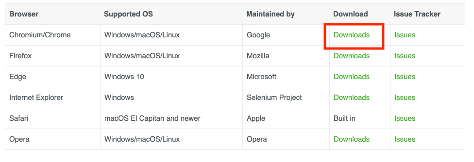

# selenium

## 1. 安装

### 1.1. python

官网下载python3图形界面安装或者我们使用brew安装python3  

1. 官网地址：https://www.python.org/  

2. brew安装，终端输入：brew install python3

### 1.2. selenium

pip3 install selenium

### 1.3. webdriver

安装对应浏览器版本的驱动：https://www.selenium.dev/documentation/en/webdriver/driver_requirements/

我的电脑浏览器是87，下载对应版本的chromedriver。  



下载成功后，配置环境变量。  

把解压后的文件放到/usr/local/bin/下，结果像这样：/usr/local/bin/chromedriver  

添加环境变量 export PATH=$PATH:/usr/local/bin/chromedriver  

## 2. get Start

功能：打开浏览器，访问百度，搜索 selenium，然后关闭浏览器。  

分别用python和javascript写了demo。  

python

```py
from selenium import webdriver
from time import sleep

class TestCase(object):
    def __init__(self):
        self.driver = webdriver.Chrome()


    def test(self):
        self.driver.get('http://www.baidu.com')
        sleep(1)
        self.driver.find_element_by_id('kw').send_keys('selenium')
        sleep(1)
        self.driver.find_element_by_id('su').click()
        sleep(3)
        self.driver.quit()

if __name__ == '__main__':
    case = TestCase()
    case.test()
```

js + node

```js
const webdriver = require("selenium-webdriver"),
  By = webdriver.By;

(async function myFunction() {
  const driver = await new webdriver.Builder().forBrowser("chrome").build();
  await driver.get("https://www.baidu.com");
  await driver.findElement(By.id("kw")).sendKeys("selenium");
  await driver.findElement(By.id("su")).click();
  await driver.quit();
})();
```
